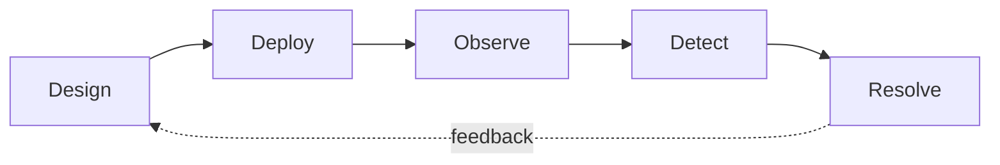

# Supabase Evals

Agent evaluations for Supabase tasks. Inspired by [next-evals](https://github.com/vercel-labs/next-evals).

This suite is organized around the Supabase customer journey: design the app, deploy it, observe what is happening, detect issues, then resolve them.

## Journey



| Category | What it measures | Scoring |
| --- | --- | --- |
| **Design** | Can the agent write good Supabase code, either directly through tool evals or in project evals that connect Supabase to a frontend? | SQL/HTTP/client tests against final state, or Vite/Vitest project checks |
| **Deploy** | Can the agent follow Supabase deployment structure: declarative schemas, migrations, CLI tooling, management API flows? | Mock management API / future CLI state matches expected |
| **Observe** | Can the agent query project and observability data so it has the right facts and context? | Report contains planted identifiers, counts, rates, or context derived from `database.query` / `logs.all` |
| **Detect** | Can the agent combine observability data and optional project state/code to identify an issue? | Report names the planted root cause and proposes a concrete fix |
| **Resolve** | Can the agent take findings and apply or propose a working fix in SQL or code? | Re-run probes against the post-fix state; issue clears without breaking expected access |

## Structure

```
experiments/      one file per (agent, model)
skills/           skills installed from supabase/agent-skills
shims/            mock mgmt-api dispatcher + backends (supalite, PGlite logs, recorders)
harness/          runner + agent driver + tool surface
evals/            eval tasks, each self-contained
results/          written per (model x eval) pair
```

## Eval Modes

| Mode | How it is detected | Agent surface | Scoring |
| --- | --- | --- | --- |
| **Tool eval** | Default eval shape (`PROMPT.md`, `EVAL.ts`, optional `seed/`) | Mock management API tools (`database.query`, `logs.all`, `functions.deploy`, ...) | Scorer uses `ctx.mgmt`, `ctx.client`, and/or `ctx.agentReport` |
| **Project eval** | Eval has `app/package.json` and `app/src/` | File tools scoped to a copied workspace (`files_list`, `files_read`, `files_write`, `files_edit`) | Scorer runs `vite build` + withheld Vitest/RTL tests against supalite |

Project eval app contents are copied per attempt to `results/<experiment>/<eval-id>/attempt-<n>/workspace/`. The agent edits only that copy. `EVAL.ts` and `tests/` are withheld during the agent turn and copied in before scoring.

## Tool Surface

Tool eval agents use mock management API endpoints. Tool names mirror real Supabase management API paths where possible:

| Tool | Real mgmt-api endpoint | Backed by |
| --- | --- | --- |
| `database.query` | `POST /v1/projects/{ref}/database/query` | supalite project DB ([shims/project-db.ts](shims/project-db.ts)) |
| `logs.all` | `GET /v1/projects/{ref}/analytics/endpoints/logs.all` | PGlite logs DB ([shims/logs-db.ts](shims/logs-db.ts)) |
| `functions.deploy` | `POST /v1/projects/{ref}/functions/deploy` | in-memory Edge Functions runtime ([shims/edge-functions.ts](shims/edge-functions.ts)) |
| `functions.list` | `GET /v1/projects/{ref}/functions` | in-memory Edge Functions runtime ([shims/edge-functions.ts](shims/edge-functions.ts)) |

Per-eval tool allowlists live in `tools.json`. Narrow them aggressively. Design RLS evals usually get only `database.query`; Observe log evals get only `logs.all`; Resolve evals get exactly the tools needed to apply the fix.

The project DB is a single supalite App backed by PGlite. `database.query`, scorers using `ctx.client`, and deployed Edge Functions using `@supabase/supabase-js` all target that same project state. Logs remain separate: `logs.all` queries a standalone PGlite table seeded from `seed/logs.ndjson`.

## Project Eval File Tools

Project eval agents get file tools instead of management API tools:

| Tool | Purpose |
| --- | --- |
| `files_list` | List files/directories relative to the workspace |
| `files_read` | Read a UTF-8 file |
| `files_write` | Write a UTF-8 file, creating parents |
| `files_edit` | Replace exactly one string occurrence in a file |

All paths are relative to the per-attempt workspace and rejected if they escape it. There is no shell access in project eval v1.

## Setup

```bash
npm install
npx skills add supabase/agent-skills
cp .env.example .env
```

Skills are pulled from [supabase/agent-skills](https://github.com/supabase/agent-skills). They are never authored locally. See [skills/MANIFEST.md](skills/MANIFEST.md) for the list this suite expects.

## Running

```bash
npm run check       # typecheck + credential-free framework smoke
npm run eval:dry    # discovery + tool plan
npm run eval        # all (model x eval) pairs that haven't run
npm run eval:force  # re-run everything
npm run eval:smoke  # one eval per category per experiment
```

Target a single experiment by filename stem or model id:

```bash
npm run eval:dry -- --experiment openai-gpt-5.4-mini
npm run eval -- --model gpt-5.4-mini
```

`scripts/smoke-framework.ts` exercises the dispatcher, tool surface, sample seeds, supabase-js auth/data calls against supalite, and sample scorers without needing an API key. Agent-backed runs require `ANTHROPIC_API_KEY` for Anthropic experiments and `OPENAI_API_KEY` for OpenAI experiments.

## Adding An Eval

Create a directory named:

```
evals/<category>-<subcategory>-<NNN>-<slug>/
```

Rules:

- `<category>` must be one of `design`, `deploy`, `observe`, `detect`, `resolve`.
- `<subcategory>` is always required, lowercase, and must not start with the numeric sequence.
- `<NNN>` is a zero-padded 3-digit number, unique within `<category>-<subcategory>`.
- `<slug>` is kebab-case and short, usually around three words.

Approved subcategories:

| Category | Subcategories |
| --- | --- |
| `design` | `rls`, `functions`, `frontend`, `storage`, `auth`, `realtime`, `db` |
| `deploy` | `cli`, `api`, `schema`, `migrations`, `secrets` |
| `observe` | `logs`, `db`, `perf`, `usage` |
| `detect` | `security`, `performance`, `reliability`, `cost` |
| `resolve` | `security`, `performance`, `reliability`, `frontend`, `db` |

Examples:

```
design-rls-003-org-roles-permissions/
design-functions-003-todos-crud-api/
design-frontend-001-todos-app/
deploy-cli-001-apply-schema/
observe-logs-001-top-error-function/
observe-db-001-table-row-counts/
detect-security-001-public-table/
detect-reliability-002-subtle-error-spike/
resolve-security-001-rls-cross-user-leak/
resolve-performance-001-slow-query-index/
```

Every eval contains:

1. `PROMPT.md` — the only task description the agent sees. Be concrete about success criteria, but do not leak exact scorer assertions.
2. `EVAL.ts` — default-export a `Scorer` from [harness/types.ts](harness/types.ts). Return `{ passed, score, notes }`.
3. `tools.json` — tool eval allowlist. Empty or missing means the experiment defaults apply, but evals should usually narrow this explicitly.
4. `skills.json` — skills from [skills/MANIFEST.md](skills/MANIFEST.md). Empty array means experiment defaults.
5. Optional `seed/project.sql` — applied to a fresh supalite project DB.
6. Optional `seed/logs.ndjson` — one JSON object per line with columns `id`, `ts`, `source`, `level`, `message?`, `metadata`.

Common scoring patterns:

| Pattern | Use for | Context |
| --- | --- | --- |
| DB state assertion | Design DB/RLS, Resolve SQL | `ctx.mgmt.call("database.query", { query })` |
| Supabase client assertion | RLS, Auth, Data API, Edge Functions | `ctx.client` plus additional clients from `ctx.mgmt.backends.projectDb.app.getClient()` |
| Report assertion | Observe, Detect | `ctx.agentReport` |
| Project checks | Frontend / full app | `ctx.workspace`, then `runProjectChecks(ctx.workspace)` |

For RLS probes in raw SQL scorers, use the same transaction-local role/JWT pattern Supabase applies internally:

```sql
BEGIN;
SET LOCAL ROLE authenticated;
SET LOCAL request.jwt.claim.sub = '<user-uuid>';
SET LOCAL request.jwt.claim.role = 'authenticated';
-- test query
COMMIT;
```

For Resolve evals, prefer black-box probes over report parsing. Seed a realistic broken state, let the agent apply a fix, then verify the resulting behavior through SQL, PostgREST, supabase-js, or project tests.

## Frontend Project Evals

Frontend evals are project evals. The agent edits a copied Vite app using file tools only; withheld tests are copied in after the agent finishes.

```
evals/design-frontend-001-auth-flow/
  PROMPT.md
  EVAL.ts
  app/
    package.json
    vite.config.ts
    tsconfig.json
    index.html
    supabase/
      config.toml
      schemas/
        schema.sql
      seed.sql
    src/
      ...
  tests/
    *.test.tsx
  skills.json
```

`runProjectChecks()` runs `vite build`, then `vitest run` with a generated setup file. That setup boots supalite from `supabase/schemas/*.sql` and `supabase/seed.sql`, then routes frontend `fetch` calls for `VITE_SUPABASE_URL` into `app.fetch`.

## Using Skills

Skills come from [supabase/agent-skills](https://github.com/supabase/agent-skills). They are not authored in this repo.

To use an existing skill in an eval:

1. Install it with `npx skills add supabase/agent-skills`.
2. Reference its directory name in the eval's `skills.json`.
3. Add it to [skills/MANIFEST.md](skills/MANIFEST.md) so contributors know it is expected.

If a skill does not exist yet, contribute it upstream rather than creating a local workaround under `skills/`.

## Adding A Management API Endpoint

Endpoints are registered in [shims/management-api.ts](shims/management-api.ts). Once registered, an endpoint is exposed to the agent subject to per-eval allowlists and callable from scorers via `ctx.mgmt.call(...)`.

To add an endpoint:

1. Add the endpoint name to the `Endpoint` union in [shims/management-api.ts](shims/management-api.ts).
2. Register a handler in `register()` with an HTTP path, description, input schema, and handler.
3. If needed, add a backend under `shims/` and wire it through `bootMgmtApi`.
4. Add it to specific eval `tools.json` files or to experiment defaults.

Backend ideas not yet built:

- `database.query_stats` for Observe/Detect/Resolve performance evals.
- `database.indexes` as a convenience over `pg_indexes`.
- `cli.run` for future Deploy evals.
- Secrets, Storage, Auth config, and Realtime shims.

Add at most one new shim per PR. Each shim is a long-lived contract.

## Adding A Model / Experiment

Create `experiments/<model-id>.ts` and default-export an `ExperimentConfig`:

- `agent`: runtime identifier. Today this is `ai-sdk`.
- `provider`: `anthropic` or `openai`.
- `model`: model id passed to that provider.
- `providerOptions`: optional provider-specific options.
- `defaultSkills`: skills loaded for every eval unless the eval narrows them.
- `defaultTools`: management API endpoint allowlist unless the eval narrows it.
- `runs`, `earlyExit`, `timeoutSec`: retry and timeout behavior.

Variants use the suffix convention `<model-id>--<variant>.ts`.

## For Agents Extending This Suite

- Do not invent manifest fields. Discovery is directory naming + `skills.json` + `tools.json` + files in `seed/`.
- Do not author skills locally. Skills live upstream in `supabase/agent-skills`.
- Do not bypass the management API dispatcher in tool evals. If the agent needs a capability, model it as an endpoint.
- Do not leak scorer assertions into `PROMPT.md`.
- Plant deterministic identifiers in Observe/Detect seeds: table names, `query_hash`, function ids, exact counts.
- Keep Resolve evals behavior-driven. The scorer should verify the issue is actually fixed.
- Update the Status table when you finish a piece.

## Status

| Piece | State |
| --- | --- |
| Eval directory layout | done (strict naming) |
| Experiment configs | done |
| Sample evals (Design / Observe / Detect / Resolve) | done |
| Skills wired to supabase/agent-skills | done |
| Mgmt-api dispatcher (`database.query`, `logs.all`, `functions.deploy`, `functions.list`) | done |
| supalite project DB (PostgREST + GoTrue + PGlite backend) | done |
| PGlite logs DB | done |
| In-memory Edge Functions runtime with supabase-js bridge | done |
| Credential-free framework smoke script | done |
| Agent driver — AI SDK Core (Anthropic + OpenAI) | done |
| Runner — discovers, executes, memoizes, retries with `earlyExit` | done |
| Project eval mode (file tools + workspace copy + Vite/Vitest scoring) | done |
| Observe category | done (logs + db evals) |
| Detect category | done (security + reliability evals) |
| Resolve category | done (security + performance evals) |
| Notify category | removed |
| Notifications shim/endpoint | removed |
| Deploy category | not started |
| `claude-code` subprocess driver | not started |
| Secrets / Storage / Auth-config endpoints | not started |
| Realtime shim | not started |
| Results export script | not started |
